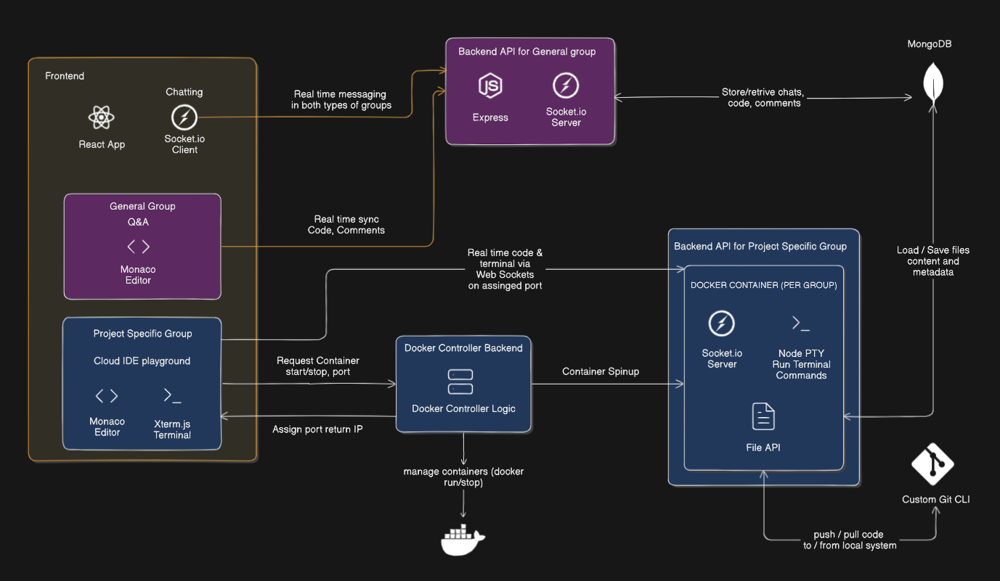
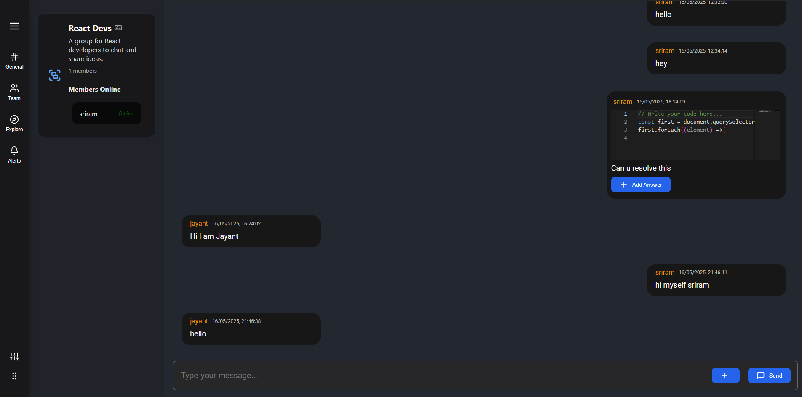
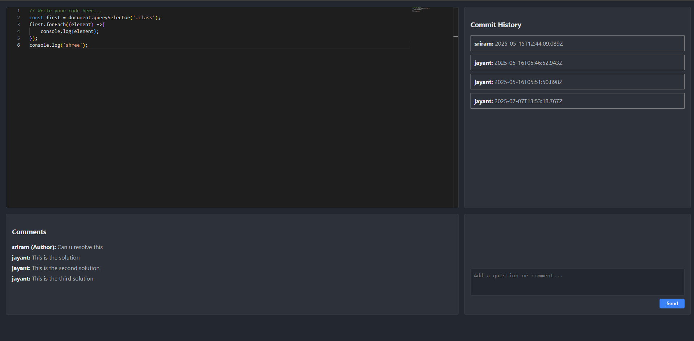

# CodeSphere – Collaborative Coding Chat Platform

A real-time group collaboration platform designed specifically for developers. CodeSphere combines the power of collaborative coding, group chat, and custom version control — all within a cloud-based IDE.

---

## System Design

### System Design Diagram

**Key Components:**
- Frontend: React, Monaco Editor, Xterm.js
- Backend: Node.js, Express, Socket.IO, Node-PTY
- Database: MongoDB (Cloud)
- Container Management: Docker (Per-project IDEs)
- Version Control Engine: Custom Git system built from scratch [GitCustard](https://github.com/SRIRAM231005/gitcustard)

---

## Preview (Currently Implemented)

### General Group Chat UI

### Code Snippet Collaboration

---

## Features

### General Group Chat (Implemented)
- Post messages and questions with editable code snippets (Monaco Editor)
- Add comments and commit-style history (Stack Overflow + Git behavior)
- Real-time code collaboration in chats using Socket.IO
- All code and comments stored in MongoDB
- Session management using JWT

---

### Project-Specific Groups (Planned/In Progress)
- Real-time cloud IDE per project
  - Monaco for code editing
  - Xterm.js + Node-PTY for live terminal
  - Docker container spins up when playground is opened
- Multi-file project structure saved in MongoDB
- Push/pull from user’s local machine using a custom Git implementation
- Optional plugin system to let users store code in their own private database

---

## Custom Git CLI (`gitcustard`) (In Progress)

A simulated version control tool tailored to CodeSphere’s environment:

- `git init` clone: creates CodeSphere repo structure
- `cat-file -p <hash>` to view Git object content
- Custom logic to store/read compressed blob, commit, and tree objects
- Supports parsing real `.git/objects` using Node.js and zlib

> Separate GitHub repo for CLI: [GitCustard](https://github.com/SRIRAM231005/gitcustard)

---

